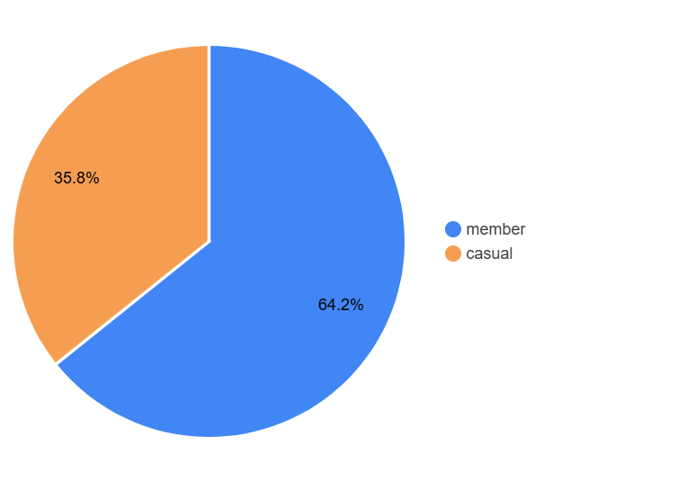
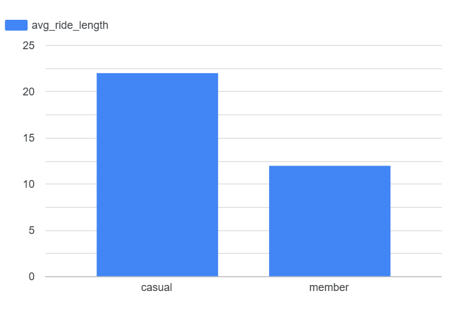
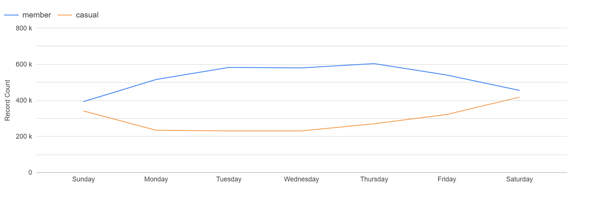
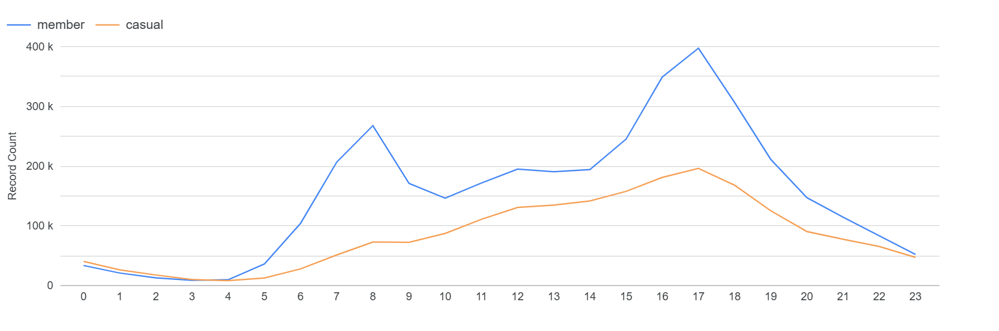

# Cyclistic Bike-Share Analysis

## Project Overview

This project was completed as part of the Google Data Analytics Professional Certificate.

The objective was to analyze the differences between annual members and casual riders of Cyclistic, a fictional bike-sharing company based in Chicago, and provide business recommendations to increase annual memberships.

---

## Business Task

Identify how annual members and casual riders use Cyclistic bikes differently and propose data-driven recommendations to encourage casual riders to become annual members.

---

## Tools Used

- SQL (Google BigQuery)
- Looker Studio
- Data Cleaning
- Data Analysis
- Data Visualization

---

## Skills Demonstrated

- Data Cleaning
- Exploratory Data Analysis (EDA)
- SQL Querying
- Business Analysis
- Data Visualization
- Data Storytelling
- Business Recommendations

---

## Repository Contents

- 📄 Cyclistic_Case_Study.pdf – Complete project report
- 📖 README.md – Project overview

---

## Key Insights

- Casual riders take significantly longer rides on average.
- Casual riders use the service more frequently during weekends.
- Annual members show a more consistent usage pattern throughout the week.
- Riding behavior differs depending on user type, suggesting different motivations for using the service.

---

## Recommendations

- Launch weekend-focused membership campaigns.
- Target frequent casual riders with promotional offers.
- Highlight the financial benefits of annual memberships for regular users.

---

## Dashboard Preview

### Total Members vs Casual Riders

This chart provides an overview of the distribution of rides between annual members and casual riders, establishing the context for the subsequent analysis.

---

### Average Ride Length

Casual riders take considerably longer rides on average than annual members, suggesting that they primarily use the service for leisure rather than commuting.

---

### Trips by Day of Week

Casual riders are more active during weekends, while annual members maintain a more consistent riding pattern throughout the week, reflecting regular commuting habits.

---

### Trips by Hour

Annual members show clear peaks during commuting hours, whereas casual riders display a more even distribution throughout the day, indicating different travel purposes.

---

## Author

Maria Capdevila

---

## Full Report

For a detailed explanation of the analysis, methodology and recommendations, see the complete report:

📄 [Cyclistic Case Study](Cyclistic_Case_Study.pdf)

Google Data Analytics Professional Certificate
